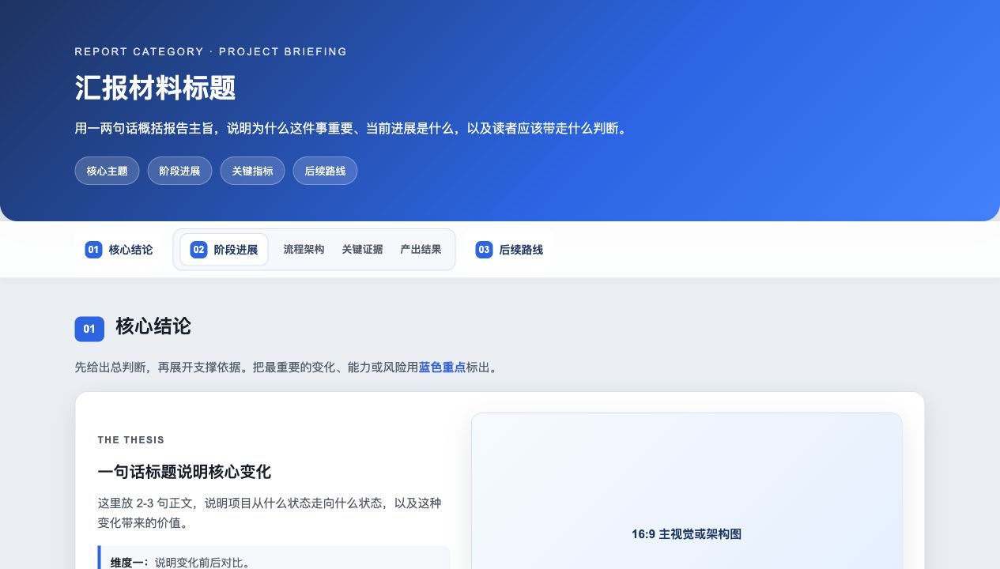
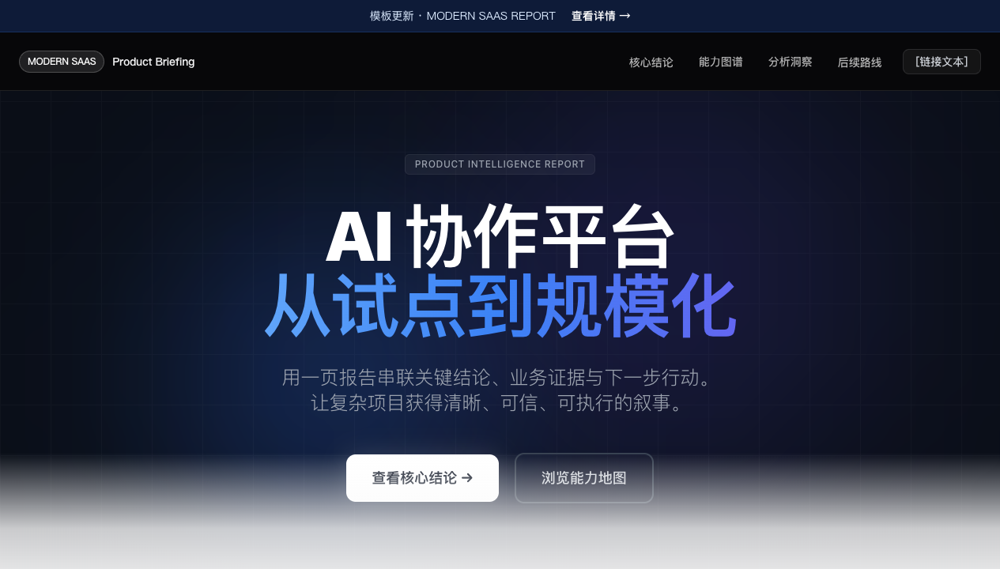

# HTML Report Builder

用于把提纲、调研笔记、截图、指标和阶段复盘材料整理成一页可分享的静态 HTML 汇报页。支持两套视觉风格：

- **Classic Enterprise（蓝白企业风）**：渐变封面、结构化导航、编号章节、白色内容卡片、KPI、表格、流程条、截图展示和可折叠原始材料。
- **Modern SaaS（硅谷高级 SaaS 风）**：深色 Hero、Scroll-aware 导航、Bento Box 卡片、Timeline、Accordion 对比表、Demo 视频和 CTA 收尾。

### Classic Enterprise 预览



### Modern SaaS 预览



## 适用场景

- 项目阶段汇报、方案说明、复盘报告和路线图材料。
- 将零散素材组织成「先结论、再证据、最后行动」的总分式叙事。
- 需要交付一个无需前端框架、可直接打开或托管的静态 HTML 文件。

## 目录说明

- `SKILL.md`：Agent 使用此 skill 时必须遵循的工作流和约束。
- `assets/report-template-classic.html`：Classic Enterprise 风格的静态 HTML 模板。
- `assets/report-template-saas.html`：Modern SaaS 风格的静态 HTML 模板。
- `assets/report-style-preview*.png`：两套视觉风格的 README 预览图。
- `references/report-style-guide-classic.md`：蓝白企业报告的视觉系统和组件规范。
- `references/report-style-guide-saas.md`：Modern SaaS 报告的视觉系统和组件规范。
- `scripts/make_standalone_html.py`：把本地图片资产内联为 Base64，生成单文件 HTML。
- `agents/openai.yaml`：skill 的 OpenAI agent 配置。

## 快速使用

1. 调用 `$html-report-builder`，并提供报告主题、受众、材料、截图或指标，同时说明想要的风格（Classic / SaaS）。
2. Agent 会先选择合适的模板与风格指南，再按「核心结论 -> 阶段进展 -> 后续路线」组织内容。
3. 报告图片放在 HTML 同级的 `assets/` 目录中，并使用相对路径引用。
4. 本地检查时启动临时服务：

```bash
python3 -m http.server 8788 --bind 127.0.0.1
```

然后打开对应的报告路径，检查图片加载、导航锚点、横向溢出、文字换行和交互组件。

## 单文件导出

如需交付一个独立 HTML 文件，可在 skill 目录或项目目录中运行：

```bash
python3 scripts/make_standalone_html.py path/to/report.html
```

脚本会默认生成 `report_standalone.html`，并把本地图片引用内联为 Base64。建议维护「HTML + assets/」版本作为源文件，交付前再生成 standalone 版本。

## 风格要点

- 使用蓝白主色、浅灰蓝背景、白色卡片和柔和阴影。
- 保持报告式首屏，不做营销落地页。
- 优先使用 `hero`、sticky nav、`.sec-head`、`.card`、`.kpis`、`.flow`、`.table-wrap`、`.shot` 等模板组件。
- 避免嵌套卡片、装饰性噪音、深色赛博风、整段高亮和空泛口号。
- 桌面端是主要阅读场景，同时要保证移动端不溢出、不重叠。
