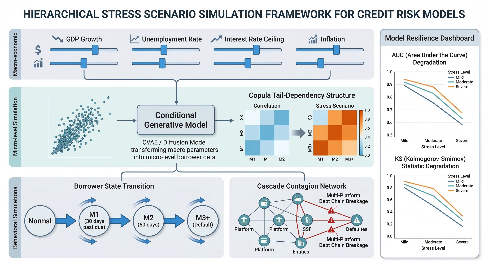

# Markdown Document Export Example

这个示例用于验证 `markdown-document-export` skill 的完整链路，覆盖：

- Mermaid 图渲染
- Mermaid 图标题
- 本地图片嵌入
- PDF / Word 双格式导出
- 表格样式增强
- 数学公式渲染

## 1. Mermaid 图标题示例

下面这个 Mermaid 代码块通过 `%% caption:` 提供图标题。导出后：

- PDF 中会显示图标题
- Word 中会生成对应的 figure caption


## 2. 本地图片示例

下面的图片使用项目现有资源文件，验证相对路径本地图片是否能被正常嵌入：



## 3. 表格样式示例

导出后应验证：

- 所有框线可见
- 表头浅灰底色
- 表头文字加粗
- 单元格有轻量内边距

| 字段 | 说明 | 预期表现 |
|---|---|---|
| 默认输出 | 未指定 `--output-format` | 生成 PDF |
| 可选输出 | `--output-format word` | 生成 DOCX |
| Mermaid 图标题 | `%% caption: ...` | 输出图标题 |
| 本地图片 | 相对路径 PNG | 正常嵌入 |

## 4. 数学公式示例

行内公式示例：$P(X)$、$P(Y|X)$

块级公式示例：

$$
\min_\theta \sup_{Q \in \mathcal{B}(P_{\text{recent}}, \epsilon)} \mathbb{E}_Q [\ell(f_\theta(x), y)]
$$

## 5. 推荐测试命令

默认导出 PDF：

```bash
python scripts/export_markdown.py \
  examples/sample-export.md
```

显式导出 Word：

```bash
python scripts/export_markdown.py \
  examples/sample-export.md \
  --output-format word
```
